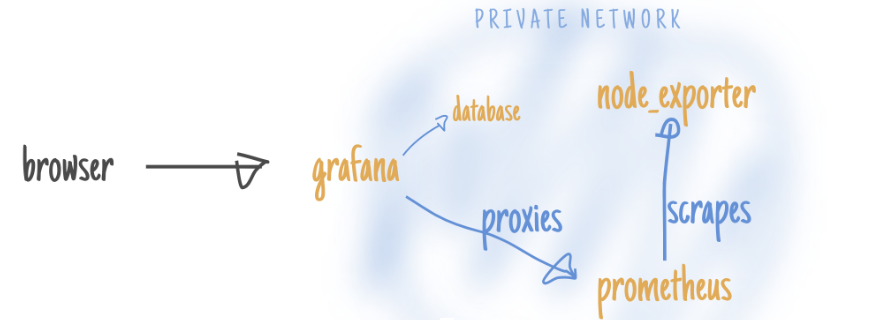

# Simple grafana monitoring of MySQL metrics

> This repo attempts to demonstrate and provide a usable mysql install on docker, with grafana monitoring captured by prometheus.
https://www.youtube.com/watch?v=Izr0IBgoTZQ



# Getting started

## Pre-req's 

Before getting started, ensure that you have the following installed locally:

- Vagrant
- Virtualbox

## Starting site

Simply run the following in this directory:

```bash
vagrant up
vagrant status
docker compose up -d

docker ps
CONTAINER ID        IMAGE                         COMMAND                  CREATED             STATUS              PORTS                                NAMES
44072be91710        google/cadvisor:latest        "/usr/bin/cadvisor -…"   17 minutes ago      Up 17 minutes       8080/tcp, 0.0.0.0:8082->8082/tcp     cadvisor8
ce0ae14737c1        prom/node-exporter            "/bin/node_exporter …"   17 minutes ago      Up 17 minutes       0.0.0.0:9100->9100/tcp               node-exporter8
6769c275f72e        basi/socat                    "/bin/sh -c 'socat -…"   17 minutes ago      Up 17 minutes       0.0.0.0:4999->4999/tcp               engine-proxy8
2d7703f2be0a        prom/prometheus               "/bin/prometheus --c…"   5 hours ago         Up 11 minutes       0.0.0.0:9090->9090/tcp               prometheus8
e460cf534c16        grafana/grafana               "/run.sh"                5 hours ago         Up 17 minutes       0.0.0.0:3000->3000/tcp               grafana8
f85a5e1060f6        prom/mysqld-exporter:latest   "/bin/mysqld_exporter"   5 hours ago         Up 17 minutes       0.0.0.0:9104->9104/tcp               mysql_exporter8
3c0f88cffc07        mysql:latest                  "docker-entrypoint.s…"   5 hours ago         Up 17 minutes       33060/tcp, 0.0.0.0:53306->3306/tcp   mysql8

## Browse node-exporter
1. Open browser : http://localhost:9100/
2. click metrics
3. refresh and see the change values

## Browse MySQLd exporter
1. Open browser : http://0.0.0.0:9104
2. see MySQLd exporter
3. see metrics
4. refresh and see the change values

## Browse Prometheus - leading open source software for scraping/querying/graphing/monitoring/alerting timeseries data(built at SoundCloud in 2012)(prometheus.io)
1. Open your browser :  http://localhost:9090 
2. click Status > Targets 
3. click Status > Rule 
  - Alerting rules are configured in Prometheus in the same way as recording rules.
  - An example rules file with an alert would be:   
3. validate that Prometheus can reach (State up) only 2 out of the 4 targets we told it to poll (in prometheus.yml)
4. click Graph to see the build-in graph visualization
5. see a long list of metrics in the drop-down. (These metrics are coming from the container named "node exporter" which produces OS-level metrics for Prometheus to poll)
6. choose a metrics
7. click execute 
8. click console
9. click graph
10. choose 15m
11. add formula in textbox above (*10 for instance)
12. refresh every minute to see a change.
13. repeat few times 6-10

## Browse grafana
0. Open browser : http://0.0.0.0:3000
1. add datasource prometheus
2. set name prometheus
3. set url=http://prometheus:9090/
4. connect and add all 3 dashboards
5. add datasource mysql
6. set name mysql
7. set Host: 172.26.0.2:3306
8. set database: testdb
9. set User: root
10. set Pass: 123
11. connect
12. if failed
13. docker inspect mysql8
14. look for "IPAddress" in json
15, put the "IPAddress" in grafana
12. if u got 'this authentication plugin is not supported'
13. docker exec -it --user root mysql8 bash
14.  mysql --user=root --password=123
15.  alter user 'root' identified with mysql_native_password by '123';
16.  exit
17. try connecting again in grafana
18. add graphs according to grafana/sql.sql
19. docker exec -it --user root grafana8 bash
20. grafana-cli plugins install grafana-worldmap-panel
21. exit
22. docker restart grafana8
23. add panel worldMap
19. vagrant destroy
```

# MySQL 

Simple install that can be accessed via:

```
mysql.server start
Host: 192.168.33.10
Port: 3306
User: root
Pass: 123
```
#### mysql problem shooting 

```
docker ps
docker logs mysql8
dokcer rm mysql8 -f
docker run --name mysql8 -d -e MYSQL_ROOT_PASSWORD=123 -p 53306:3306 mysql:latest
docker inspect mysql8
look for "IPAddress" in json
put the "IPAddress" in grafana
look for #### "Destination": "/var/lib/mysql"

open mysql workbench
Host: 0.0.0.0
Port: 53306
User: root
Pass: 123
run db_schema.sql
run db_data.sql
```
  
# MySQL Metrics 

In order to provide this info in a fancy way, I've hooked in grafana and set it up with the percona dashboards to visualize the info.  You can access the info here:

[Grafana Percona dashboards](http://192.168.33.10/dashboard/db/mysql-overview-percona-app?from=now-15m&to=now)

```
Username: admin
Password: admin
```

# How it works

The way that this vagrant instance is set up is by installing docker on the vagrant instance, and then creating a few containers to do all the work.  In this setup we have the following:

1. `mysql` container: simple setup of a mysql instance
1. `prometheus` container: timeseries database storage for metrics storage
1. `grafana` container: graphing tool to visualize information from mysql / prometheus
1. `prom_mysql_exporter` container: tool to collect data from mysql and store in prometheus


# Design decision

This repo is consciously designed to have two separate aspects of the setup (docker + ansible within vagrant), for 2 reasons: the grafana docker image doesn't contain much by way of configuration of the dashboards/users, and, that it should not be used as a production service.  It should be broken down into its separate components based on your desired infrastructure.  This is just a demo to get you up and running quickly. 

 
